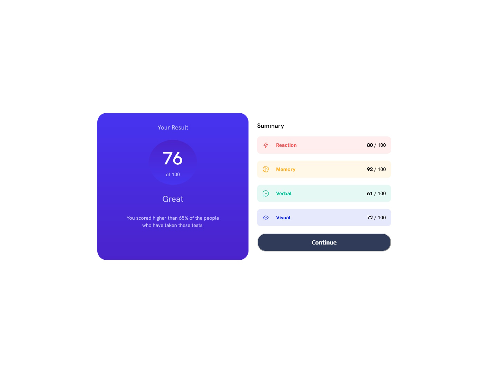
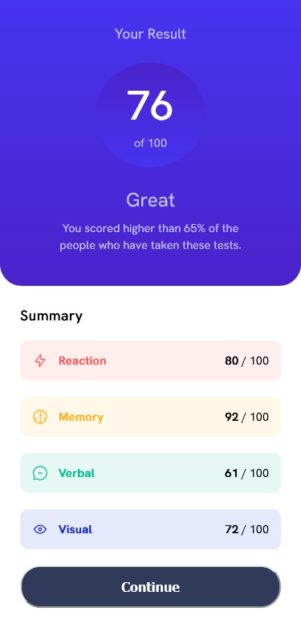

# Frontend Mentor - Results summary component solution

This is a solution to the [Results summary component challenge on Frontend Mentor](https://www.frontendmentor.io/challenges/results-summary-component-CE_K6s0maV). Frontend Mentor challenges help you improve your coding skills by building realistic projects. 

## Table of contents

- [Overview](#overview)
  - [The challenge](#the-challenge)
  - [Screenshots](#screenshots)
  - [Links](#links)
- [My process](#my-process)
  - [Built with](#built-with)
  - [What I learned](#what-i-learned)
  - [Continued development](#continued-development)
  - [Useful resources](#useful-resources)
- [Author](#author)

## Overview

### The challenge

Users should be able to:

- View the optimal layout for the interface depending on their device's screen size
- See hover and focus states for all interactive elements on the page
- **Bonus**: Use the local JSON data to dynamically populate the content

### Screenshots





### Links

- [Solution](https://github.com/theGamingKitten/results-summary-component-main)
- [Live Site](https://thegamingkitten.github.io/results-summary-component-main/)

## My process

### Built with

- Semantic HTML5 markup
- CSS
- Flexbox
- CSS Grid
- Mobile-first workflow
- JavaScript

### What I learned

To be able to read data from a json-file (local) you need to set the type of the script to "module".

```html
<script type="module" src="script.js"></script>
```
```js
import data from './data.json' assert { type: 'json' };
console.table(data);
// using console.table shows data in a better readable format than .log
```

### Continued development

In the upcoming projects I want to use more JavaScript again.
And try using SASS more.

### Useful resources

- [freeCodeCamp News](https://www.freecodecamp.org/news/how-to-read-json-file-in-javascript/) - An article that helped me importing data from the json-file

## Author

- Frontend Mentor - [@theGamingKitten](https://www.frontendmentor.io/profile/theGamingKitten)